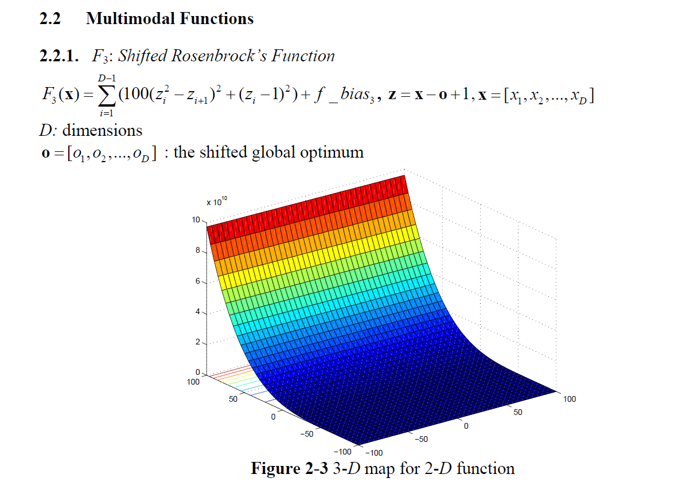

# Continuous optimization : F3 : Shifted Rosenbrock’s Function

Properties:
 Multi-modal
 Shifted
 Non-separable
 Scalable
 Having a very narrow valley from local optimum to global optimum
 Dimension D as 100, 500 and 1000
 x∈[−100,100]D , Global optimumx* = o , *
3( ) 3 F x = f_bias = 390

Associated Data file:
Name: rosenbrock_shift_func_data.mat
Variable: o 1*1000 vector the shifted global optimum
When using, cut o=o(1:D) for D=100, 500
