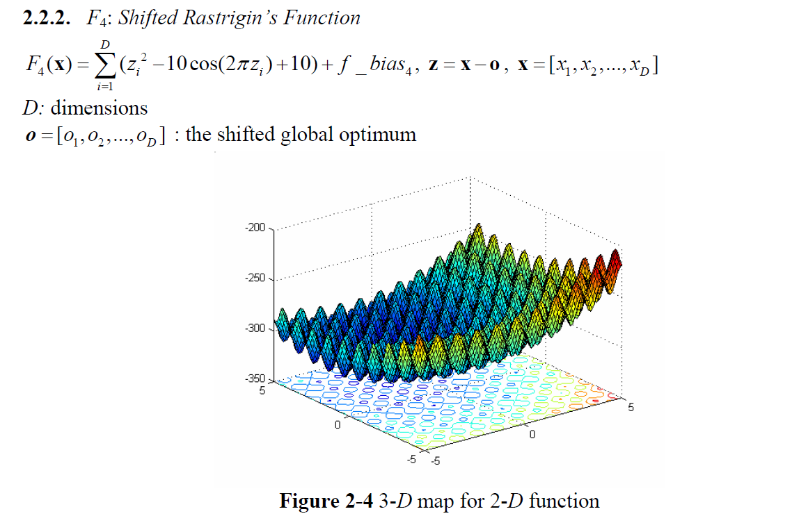

#Continuous optimization : F4: Shifted Rastrigin's Function

Properties:
 Multi-modal
 Shifted
 Separable
 Scalable
 Local optima’s number is huge
 Dimension D as 100, 500 and 1000
 x∈[−5,5]D , Global optimumx* = o , *
4( ) 4 F x = f_bias = - 330

Associated Data file:
Name: rastrigin_shifit_func_data.mat
Variable: o 1*1000 vector the shifted global optimum
When using, cut o=o(1:D) for D=100, 500
